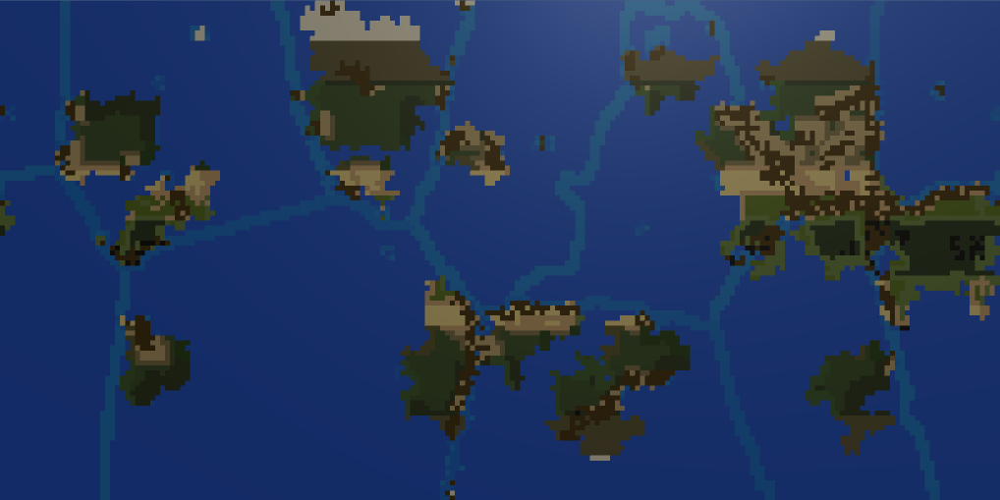
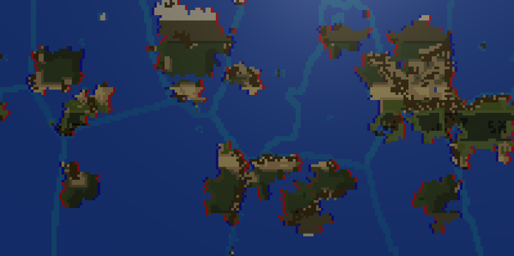
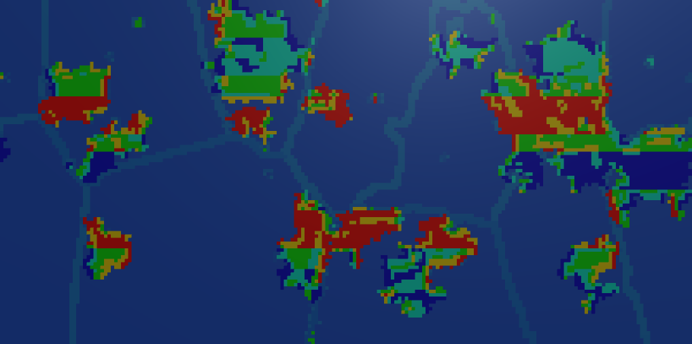
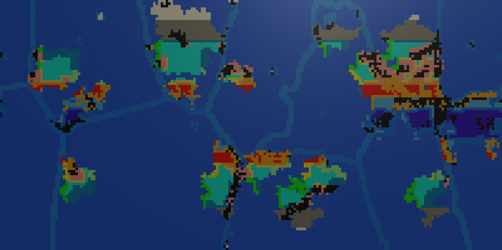

# TerraPlanetCreator

This is a Earthlike planet generator that creates tectonics, continents, mountains, wind direction, ocean currents, precipitation, and climate in a semi-scientific manner.

This uses Unity to render the world visually, although you can take the main script and remove the unity bits to use in a non-Unity project. The data is saved in a Dictionary of Vector2s and the data at that Vector2.

To run, load the scene TectonicSimulation.unity and press play! To enable the currents, precipitation, and climate view, just enable/disable the gameobjects.

The main script is TectonicStaticSimulation.cs, which is pretty self explanitory.

Other important script is the continent generator ZoomLandCreation.cs, which uses the method to create continents from this method under "Grown Biomes" http://mc-server.xoft.cz/docs/Generator.html#heightgen

# Ocean Currents

# Precipitation

# Climate

# Future Improvements
- Tectonic plates sometimes create perfectly horizontal/verticle walls that look unnatural, likely need to spread them out a certain distance.
- Continents are acceptable, but often times dont end up unique like our own planet earth does, usually very round looking continents.
- Ocean currents could be improved for small indintations that will get both cold and warm currents on either side. Similar situation with lakes.
- Desert "Band" doesnt look natural, I think the climate zones look good but they could be improved to use more precipitation data.
- Precipitation stats are kinda guessed :)
- Im not happy with mountains, but resolution is so low hard to mess around with it too much.
